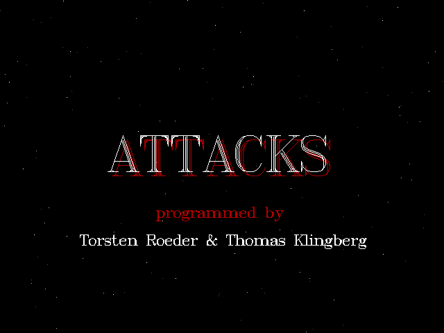
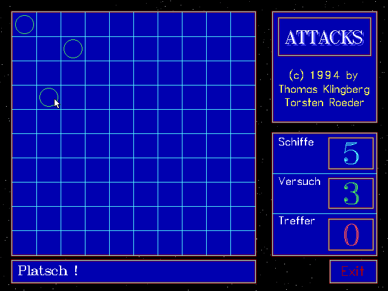
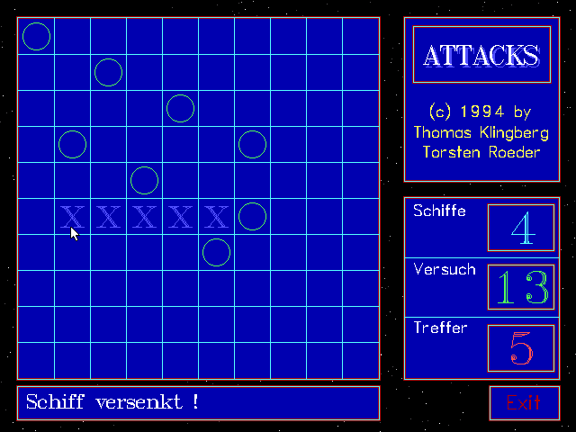
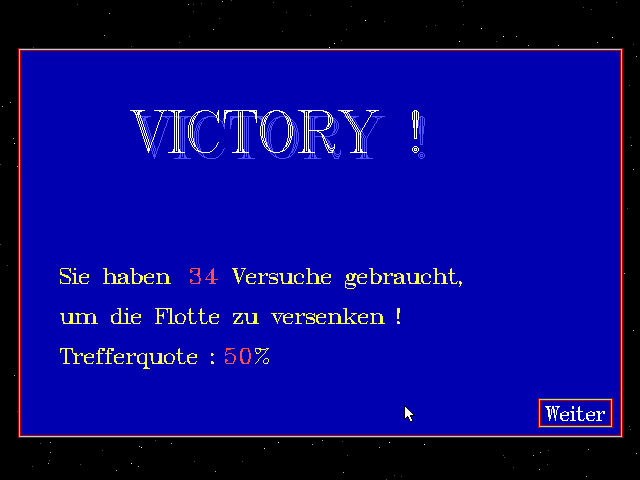
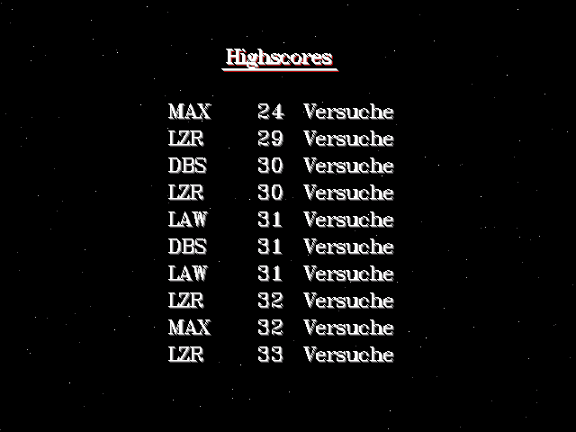

# ATTACKS

A simple PvE implementation of »Battleships«. I programmed this in 1994 with my high school mate Thomas. Original highscore records included.

## How to play

Your task is to sink the enemy fleet! Click on the grid to shoot. `X` is a hit. The enemy has five ships: one `XXXXX`, one `XXXX`, two `XXX` and one `XX`, so you need 17 hits in total. The distance between the ships is at least one square.

## Files

* ATTACKS.PAS - Turbo Pascal sourcecode
* SCORE.DAT - highscore records
* README.md - this document

### Binaries

Executable files are available here: [attacks.zip](http://turbo.elitepiraten.de/attacks.zip)

## Screenshot

It seems we spent as much time on the intro as on the game.

We noticed later that the ship placing algorithm favored the top left corner.

First ship sunk.

Well, you need more hits for a highscore record.

Marksman Max: 17 hits, 7 misses.

