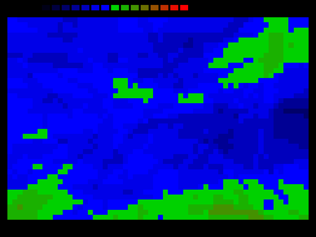

# BROWN

An implementation of a [Brownian surface](https://en.wikipedia.org/wiki/Brownian_surface) algorithm to generate a random geographic map.

Press any key to run the algorithm once, or press `1`..`9` to run that number of cycles. Press `+` or `-` to elevate or lower the whole map.

## Files

* BROWN.PAS - Turbo Pascal sourcecode
* README.md - this document

### Binaries

An executable file is available here: [brown.zip](http://turbo.elitepiraten.de/brown.zip)

## Screenshot

