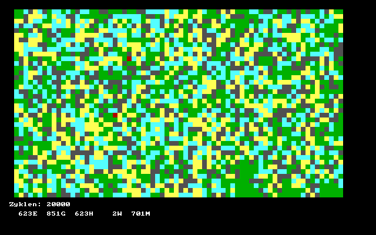

# EVOLUTE

## What is Evolute?

A simple [predator-prey simulation](https://en.wikipedia.org/wiki/Lotka%E2%80%93Volterra_equations) in two variants.

## Rules

The simulation takes place on a grid. The squares are populated by either grass, rabbits or wolves (or also humans). Each step in time, one square is determined randomly. Depending on the population on that square and on the surrounding squares, specific rules are applied.

### EVOLUTE

This simulation features four states: EBENE, GRAS, HASE, and WOLF (plains, grass, rabbit, wolf). It starts in a plain world with 20 rabbits and 10 wolves.

* EBENE becomes GRAS. _(grass grows anywhere)_
* GRAS becomes HASE if there is a HASE nearby. _(rabbits procreate on grass)_
* HASE becomes WOLF if there is a WOLF nearby. _(wolves eat rabbits)_
* WOLF becomes EBENE. _(wolves just die)_

In this world, two outcomes are likely: a balanced competition of all four states, or the rabbits take over the world.

### EVOLUTE2

This simulation features five states: EBENE, GRAS, HASE, WOLF, and MENSCH (plains, grass, rabbit, wolf, human). It starts in a plain world with 20 rabbits, 50 wolves and 10 humans.

* EBENE becomes GRAS. _(grass grows anywhere)_
* GRAS becomes HASE if there is a HASE nearby. _(rabbits procreate on grass)_
* HASE:
  * if there is a WOLF nearby, it becomes WOLF; _(wolves eat rabbits)_
  * otherwise, if there is a HUMAN nearby, it becomes HUMAN; _(humans like rabbits too)_
  * otherwise, if there is a HASE nearby, it becomes GRAS. _(rabbit overpopulation)_
* WOLF becomes MENSCH if there is a MENSCH nearby, otherwise it becomes EBENE. _(wolves are shot or they just die)_
* MENSCH becomes EBENE if there is a MENSCH nearby. _(humans kill each other)_

In this world, it is possible (but not likely) that the wolves go extinct.

Things do not look too great for the wolves in this screenshot. But as long as there are enough rabbits around, the wolves' chance to recover is higher than that to die out.

## Controls

Press or hold any key to start the simulation. Press `backspace` to enter another number of cycles and `esc` to end the program.

## Files

* EVOLUTE.PAS - Turbo Pascal sourcecode
* EVOLUTE2.PAS - Turbo Pascal sourcecode
* EVOLUTE2.PAS - a screenshot
* LICENSE.TXT - license information
* README.md - this document

### Binaries

Executable files are available here: [evolute.zip](http://turbo.elitepiraten.de/evolute.zip)
