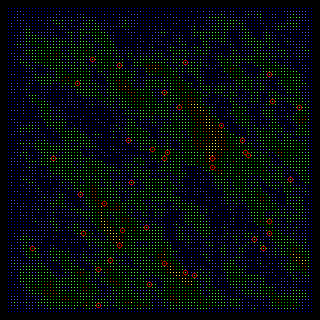
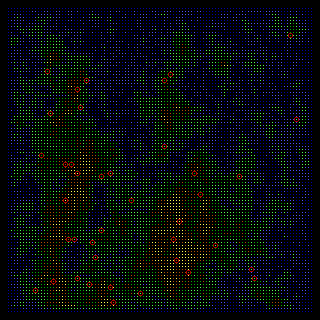
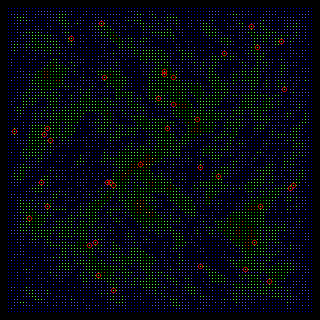
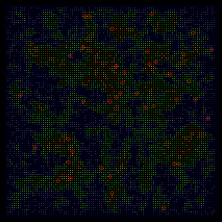
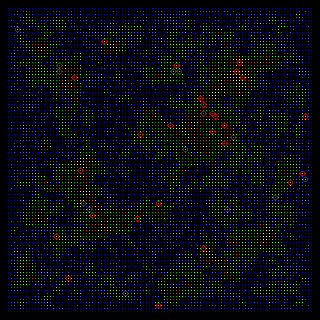
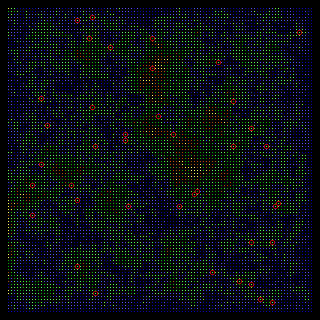

# LAND

A configurable generator for geographic maps.

The algorithm takes the surrounding and various parameters into account. There are six different methods available to start the generator.

## Controls

Press `F1`..`F10` to modify the parameters, and `1`..`6` to start with one of the available methods. `Esc` to end the program.

## Files

* LAND.PAS - Turbo Pascal source code
* LAND1.PNG - a screenshot
* LAND2.PNG - a screenshot
* LAND3.PNG - a screenshot
* LAND4.PNG - a screenshot
* LAND5.PNG - a screenshot
* LAND6.PNG - a screenshot
* LICENSE.TXT - license information
* README.md - this document

### Binaries

An executable file is available here: [land.zip](http://turbo.elitepiraten.de/land.zip)

## Screenshots

_Some maps, each generated with another method:_

