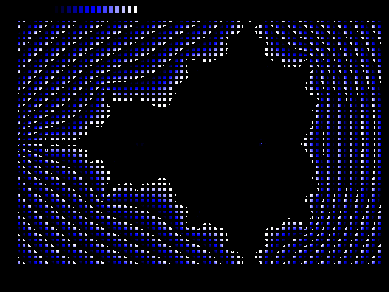
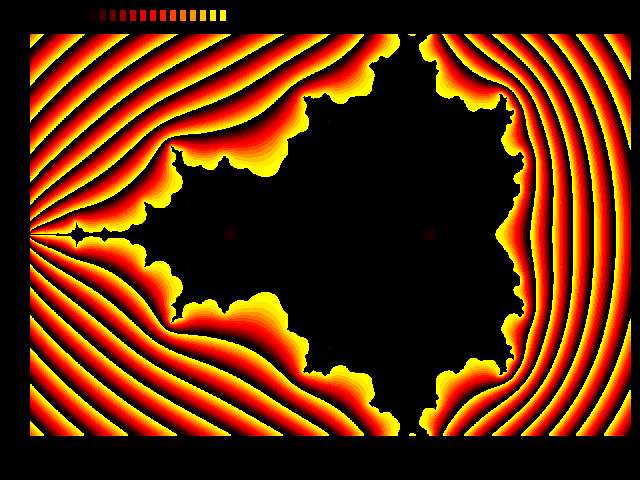
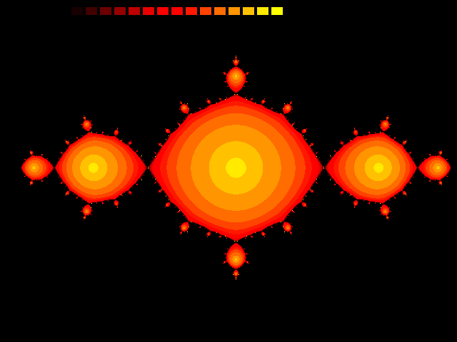
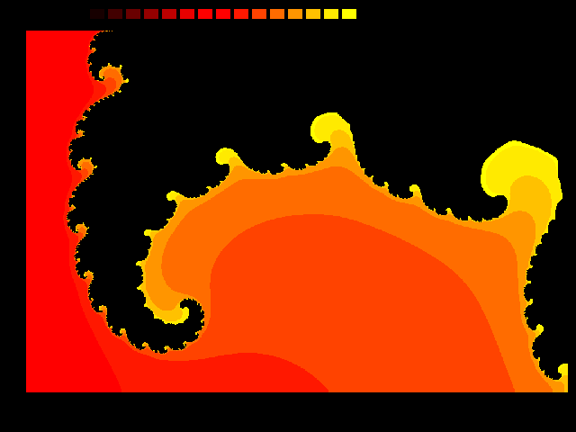

# MANDEL

Four visualization programs of [Mandelbrot](https://en.wikipedia.org/wiki/Mandelbrot_set) and [Julia set](https://en.wikipedia.org/wiki/Julia_set).

## Versions

* **MANDEL** – Draws a Mandelbrot set. Pixel style.
* **MANDEL2** - Draws a Mandelbrot set. Area fill style.
* **MANDEL3** – Draws a Julia set. Area fill style.
* **MANDEL4** – Draws Mandelbrot sets and corresponding Julia sets.

## Parameters / Controls

MANDEL4 offers come keyboard controls: `1`..`9` zooms into one section of the screen (numpad layout), `+`/`–` raise/lower the density of the image, and `space` switches between Mandelbrot and Julia. Press `Esc` to end the program.

In MANDEL, MANDEL2 and MANDEL3, parameters can be modified only directly in the source code.

## Files

* MANDEL.PAS - Turbo Pascal source code
* MANDEL.PNG - a screenshot
* MANDEL2.PAS - Turbo Pascal source code
* MANDEL2.PNG - a screenshot
* MANDEL3.PAS - Turbo Pascal source code
* MANDEL3.PNG - a screenshot
* MANDEL4.PAS - Turbo Pascal source code
* MANDEL4.PNG - a screenshot
* LICENSE.TXT - license information
* README.md - this document

### Binaries

An executable file is available here: [tiles.zip](http://turbo.elitepiraten.de/tiles.zip)

## Screenshots

_from MANDEL:_

_from MANDEL2:_

_from MANDEL3:_

_from MANDEL4:_

