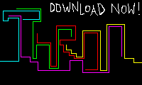

# THRON

## What is Thron?

A game for up to six human or computer players, based on the arcade game »Lightcycles« from the famous movie »[Tron](https://www.imdb.com/title/tt0084827/)«.

## How to start

Executable files are available here:

You will need an emulator like [DOSBox](https://www.dosbox.com) to start the game.

## Files

* LICENSE.TXT - license information
* LIESMICH.TXT - German manual
* README.md - this document
* README.TXT - English manual
* THRON.PNG - image for download link
* THRON3GR.PAS - Turbo Pascal sourcecode for German keyboard layout
* THRON3US.PAS - Turbo Pascal sourcecode for US keyboard layout
