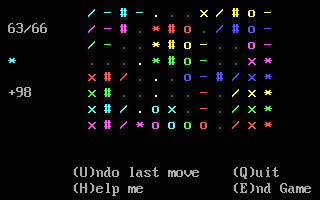

# TILES

## What is Tiles?

A combination board game for one player. The task is to arrange 72 tiles on a rectangular 12x8 board.

### Rules

* Each tile has a color and a symbol. There are six colors and six symbols. Each tile exists twice.
* The game starts with six tiles on the board.
* A tile must be placed next to another tile, and it must match either color or symbol of all adjacent tiles.
* No tile on the board can match the color or the symbol of adjacent tiles more than twice.
* The tile to be placed is drawn randomly, and you will see only one tile at a time.
* You can undo one turn at any point of the game, but not more than one.

The game ends when all 66 tiles have been placed on the board or when the player resigns, e.g. when it is impossible to place any more tiles.

### Scoring

The secondary task is to score as many points as possible. You get points for placing a tile, depending on the number of adjacent tiles:

* 1 tile: 1 point
* 2 tiles: 2 points
* 3 tiles: 4 points
* 4 tiles: 8 points

Highscores are saved in a separate file. Can you beat 123 points? What is your strategy?

## Controls

Pretty self-explaining. The current tile is displayed on the left. Use `↑` `←` `↓` `→` to move the cursor, and press `Enter` to place a tile. In case you are stuck or lazy, `H` displays all possible positions for the current tile. If there is no valid position, press `U` to undo your turn or `E` to end the current game (highscores will still be applied).

## Background information

I think the game was once presented in a computer magazine, and I just cloned it.

## How to run the game

An executable file is available here: [tiles.zip](http://turbo.elitepiraten.de/tiles.zip)

You will need an emulator like [DOSBox](https://www.dosbox.com) to start the game.

## Files

* LICENSE.TXT - license information
* README.md - this document
* TILEHIGH.DAT - highscore records
* TILES.PAS - Turbo Pascal source code
* TILES.PNG - a screenshot
