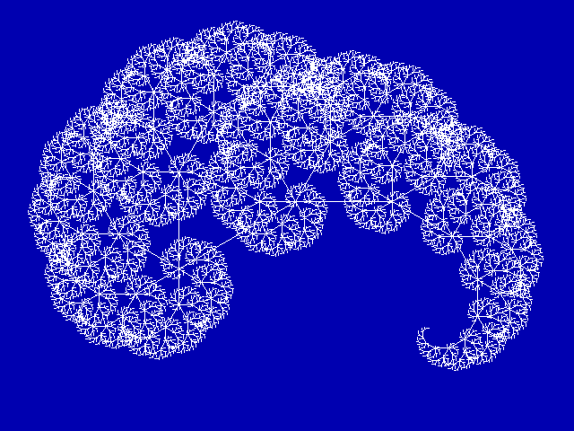
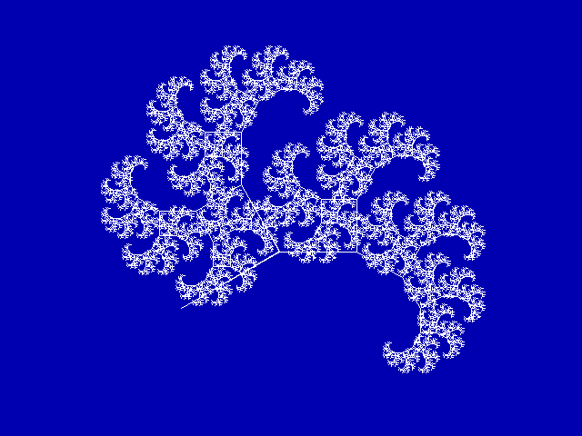
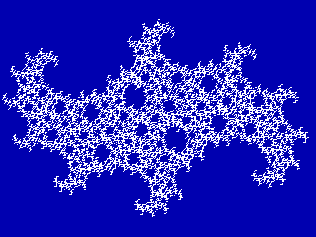

# TURTLE

Two programs with various recursive turtle drawings.

## Variations

* **BESEN** – Four tree recursions.
* **REKURS** - Six (actually seven) geometric recursions.

## Parameters / Controls

Pretty self-explaining. In REKURS, a seventh (hidden) recursion can be accessed by typing `g`.

## Files

* BESEN.PAS - Turbo Pascal source code
* README.md - this document
* REKURS.PAS -  Turbo Pascal source code
* TURTLE.PAS - Turbo Pascal source code (turtle unit)
* TURTLE1.PNG - screenshot from BESEN.PAS
* TURTLE2.PNG - screenshot from BESEN.PAS
* TURTLE3.PNG - screenshot from BESEN.PAS

## Screenshots

_from BESEN:_

